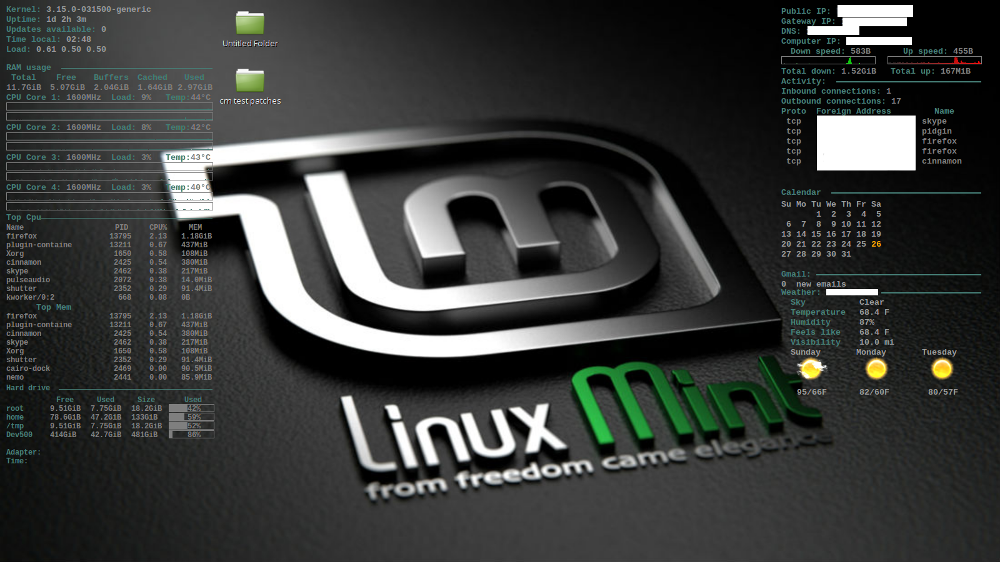

## Designed on mint 17
## Conky

## Installation
-copy the .conky folder to ~/.conky.

## Post Installation
- set username and app password in gmail.pl.
- set city, state, and weatherunderground api key in weather.rb.
- run conky_start.
- add conky_start to startup applications when finished modifying.
- adjust drives and cpu cores.
- adjust weather for C or F (F is set)
- more adjustments may be necessary based on your system.

## Dependencies
-Conky with nvidia plugin.
-ruby for weather underground.
-perl for gmail.
-bash for startup script (will work in sh).

Weather:  
  - api_key from http://www.wunderground.com/weather/api/

Gmail:
  - password should be added as an application password in your security settings.
